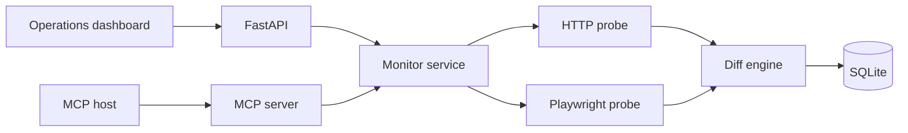

# LumenWatch Agent

Website change intelligence through HTTP capture, optional browser automation,
SQLite history, a FastAPI dashboard and Model Context Protocol tools.

LumenWatch watches product pages, status screens and documentation, compares
each capture with the previous version and turns raw diffs into a severity,
summary and compact list of added or removed words.

## What it demonstrates

- Python 3.11, FastAPI and async I/O
- HTTP monitoring with Beautiful Soup content extraction
- optional Playwright rendering and full-page screenshots
- SQL persistence for targets and immutable snapshots
- deterministic diff scoring and incident severity
- MCP tools for use by agentic clients
- responsive frontend with no build step
- pytest, Ruff, Docker and GitHub Actions

## Architecture



## Quick start

```powershell
git clone https://github.com/rom4ik1346/lumenwatch-agent.git
cd lumenwatch-agent
python -m venv .venv
.\.venv\Scripts\python.exe -m pip install -e ".[dev]"
.\start.ps1
```

Open:

- dashboard: `http://127.0.0.1:8020`
- Swagger UI: `http://127.0.0.1:8020/docs`
- health check: `http://127.0.0.1:8020/api/health`

Two fictional watch targets and a high-severity change are seeded on first
launch, so the dashboard is populated before any network request.

## Browser mode

HTTP mode works after the normal install. To capture JavaScript-rendered pages
and screenshots:

```powershell
.\.venv\Scripts\python.exe -m pip install -e ".[browser,dev]"
.\.venv\Scripts\python.exe -m playwright install chromium
Copy-Item .env.example .env
```

Then set:

```dotenv
LUMENWATCH_BROWSER_ENABLED=true
```

Targets with `render_js=true` will use Chromium. If browser mode is disabled,
they safely fall back to the HTTP probe.

## MCP server

```powershell
.\.venv\Scripts\python.exe -m app.mcp_server
```

Example client configuration:

```json
{
  "mcpServers": {
    "lumenwatch": {
      "command": "C:\\path\\to\\lumenwatch-agent\\.venv\\Scripts\\python.exe",
      "args": ["-m", "app.mcp_server"],
      "cwd": "C:\\path\\to\\lumenwatch-agent"
    }
  }
}
```

Available tools:

- `create_watch_target`
- `run_watch`
- `list_watch_targets`
- `list_recent_changes`
- `get_change_details`

## REST examples

Create a target:

```powershell
Invoke-RestMethod `
  -Method Post `
  -Uri http://127.0.0.1:8020/api/targets `
  -ContentType "application/json" `
  -Body '{"name":"Example","url":"https://example.com","interval_minutes":30}'
```

Run it immediately:

```powershell
Invoke-RestMethod `
  -Method Post `
  -Uri http://127.0.0.1:8020/api/targets/TARGET_ID/run
```

## Tests

```powershell
.\.venv\Scripts\python.exe -m ruff check .
.\.venv\Scripts\python.exe -m pytest --cov=app
```

## Docker

```powershell
docker compose up --build
```

The default container uses the lightweight HTTP probe and stores its database
in the `lumenwatch-data` volume.

## Project structure

```text
app/
  database.py      targets and immutable snapshots
  diff_engine.py   similarity, severity, additions and removals
  probes.py        HTTP and Playwright capture strategies
  service.py       monitoring orchestration
  main.py          REST API and dashboard
  mcp_server.py    MCP tool surface
  static/          frontend
tests/             unit and API tests
```

## License

MIT

